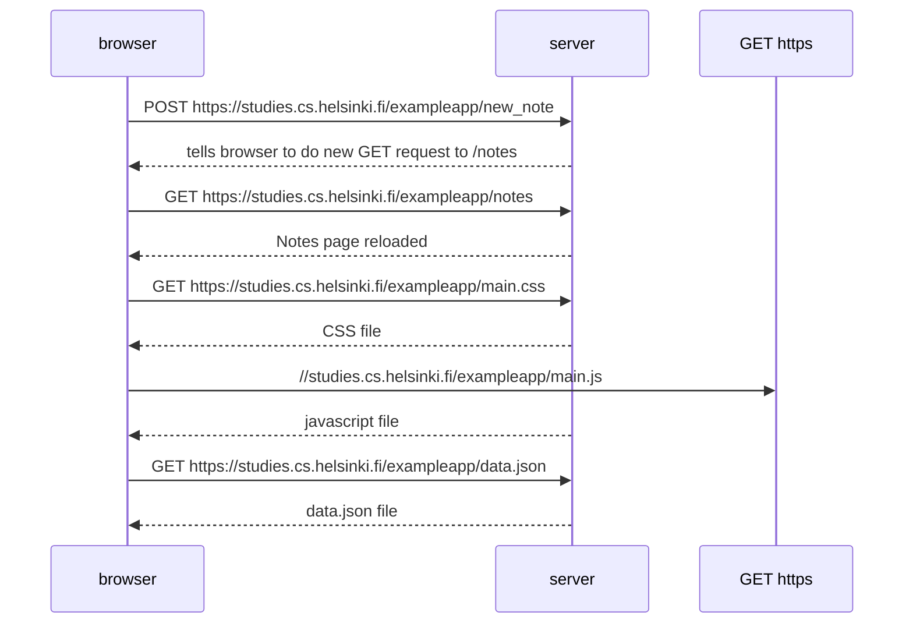

```mermaid
  sequenceDiagram
    participant browser
    participant server
    browser->>server: POST https://studies.cs.helsinki.fi/exampleapp/new_note
    server-->>browser: tells browser to do new GET request to /notes
    browser->>server: GET https://studies.cs.helsinki.fi/exampleapp/notes
    server-->>browser: Notes page reloaded
    browser->>server: GET https://studies.cs.helsinki.fi/exampleapp/main.css
    server-->>browser: CSS file
    browser->> GET https://studies.cs.helsinki.fi/exampleapp/main.js
    server-->>browser: javascript file
    browser->>server: GET https://studies.cs.helsinki.fi/exampleapp/data.json
    server-->>browser: data.json file
```
